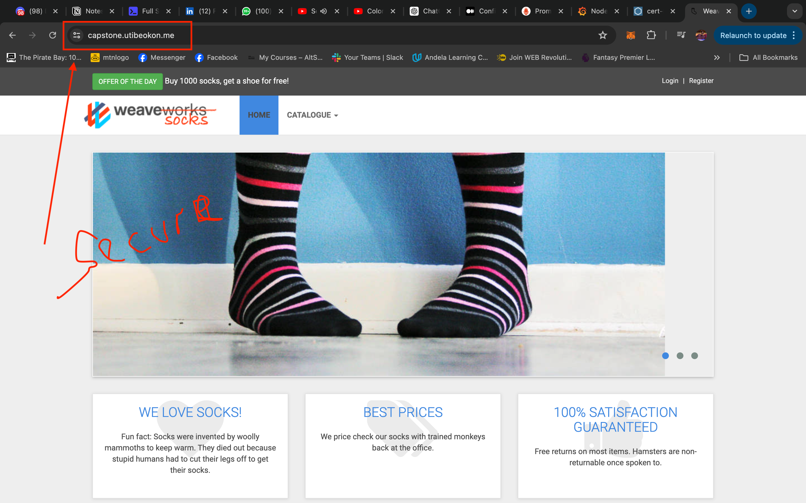

# Overview
A microservices-based application packaged using kubernetes is provided. There is need to automate it's deployment using cloud services and DevOps core practices like automation, IaC, monitoring/logging and CI/CD. There is also need to ensure security measures and proper encryption on the hosted application. 
The following tools/platforms will be used to implement the core requirements of the project:
- Terraform
- Azure Kubernetes Service
- Prometheus/Grafana
- Github Actions

## The Application
The provided application SockShop uses a microservices architecture, it is deployed using docker and kubernetes. It has 14 microservices that both have at least a deployment and a service kubernetes object and they are all connected to each other. The application is accessible by the user via the `front-end` microservice.

## The Workflow
To deploy the application, several tools and best practices will be leveraged. Azure Kubernetes Service will be used as the cloud provider for infrastructure, Terraform for infrastructure as code (Azure Blob storage as a remote backend), Kubernetes for container orchestration (with Helm, it's package manager), Nginx Ingress Controller for routing traffic to the services within the cluster, Prometheus Stack for logging, monitoring and alerting, Github Actions to implement CI/CD, Let's Encrypt for certificate issuance and Azure Firewall for overall security.

Below is an overview of the complete workflow:
    

## The Process
### Prerequisites
Should you want to recreate the process using the code provided on this repo, these are things you will need to setup first:
- Helm
- Az CLI (configured to an active azure subscription)
- Kubectl
- Terraform

Project Folder setup:
    

### Steps
__Terraform__
Terraform is an infrastructure as code tool. It is commonly used to provision infrastructure on cloud services, but there is also so much more to Terraform. The provided [terraform configuration](./terraform/main.tf) written in modules is used to create the following resources on Microsoft Azure:
- A resource group
- A virtual network and two subnets
- AKS (a managed kubernetes cluster)

Addditionally, the terrraform configuration has configured to use a remote backend for it's state management and the helm provider is used to install ingress and prometheus stack on the cluster. In normal cases, the cluster will be created by IaC tool and after that team would use a helm package manager externally to manage the charts for the Kubernetes cluster, but with helm providers terraform can be used directly to manage helm charts in a Kubernetes cluster, hence once the terraform configuration is applied, we wil have a fully managed kubernetes cluster ready to deploy our application.
    
    
    

__Deployment__
To get the the application up and running:
Locate the deployment file(s) that in the [kubernetes](./kubernetes/) directory and using `kubcetl` apply the deployment file(s) in the cluster using the following steps.

- Apply manifest files
    Do, `kubcetl apply -f kubernetes/deployment.yaml`, 
    After this, application should be up and running and you can inspect using kubectl commands like `get pods` and `get svc`. The app can also be accessed on the browser by port forwarding the `front-end` service nodeport.
        
        
        

- Configure and apply [ingress](./kubernetes/ingress.yaml)
     Ingress allows you to define rules for how external traffic should be directed to your services, enabling you to expose your applications to the internet or other networks. The ingress configuration is can be found in the oroject folder, configure and apply. Rememember to map your ingress IP address on your DNS service provider. If successful, the application should be up and available via the domain name.
        

__Logging, Monitoring, Alerting__
- Setup prometheus and grafana
    Prometheus is used in a cluster to get metrics on the state of the cluster and the apllication running on it. It can be configured and different set of metrics queried from it. Grafana can also be used to to monitor the state of your cluster and application, it get metrics from prometheus and displays it in a visually appealling form.
    These are already installed in the cluster. You have to configure the them and reteive the data ypu need to be displayed using grafana tho. Access the grafan webpage to build a dashboard using metrics from prometheus.
        
        
    It is also ideal to define the prometheus and grafana endpoints using ingress so they can be accessible using the domain name.
        

- Setup alert
    Alert manager is part of the prometheus stack that was installed. It also uses metrics provided by prometheus.
        

__TLS certificate__
    Encrypting data gotten from user requests to a web application is no longer a requirment, it is a necessity, users genraally feel safe when they visit webapps that are properly encrypted. 
    Cert-manager can be installed and using the issuer file provided, a tls certificate request can be made to letsencrypt.
        
        

__Github actions__
GitHub Actions is a powerful automation tool provided by GitHub. It allows you to define custom workflows that automate various tasks in your software development process. These tasks can include building, testing, and deploying your code, as well as performing other actions like sending notifications or creating releases.

--explain process i used to solve the problem-
--explain the terraform and where it takes you to-
--explain what you did after the terraform-
--explain setting up the other parts-

__Azure Firewall__

  
Using Firewall

  **This is the content inside the dropdown.**  
    Yes, you can use Azure Firewall with your AKS cluster to add an additional layer of security. Here's how you can do it:

    1. Create an Azure Firewall resource in your Azure subscription. You can do this through the Azure portal or by using Azure CLI or Azure PowerShell.

    2. Configure the Azure Firewall to allow outbound traffic from your AKS cluster. This will enable your cluster to communicate with external resources such as APIs, databases, or other services. You can define network rules and application rules to control the traffic flow.

    3. Configure the AKS cluster to use the Azure Firewall as its egress gateway. This can be done by modifying the network configuration of your AKS cluster. You will need to update the network profile and specify the Azure Firewall as the egress gateway.

    4. Update the network security group (NSG) rules for your AKS cluster. You will need to allow inbound traffic from the Azure Firewall to the AKS cluster nodes. This will ensure that the cluster can receive traffic from the Azure Firewall.

    5. Test the connectivity between your AKS cluster and external resources. You can deploy a sample application or use existing services to verify that the traffic is flowing through the Azure Firewall.

    By following these steps, you can integrate Azure Firewall with your AKS cluster and enhance the security of your microservices-based application.

## The End?
DevOps never ends, as software is ever changing and evolving, having implemented ci/cd, continous integration of new code into existing one.

__Continous Integration and Continous Deployment__
-explain ci/cd workflow-
-show demo-

__Summary__
Thank you.
