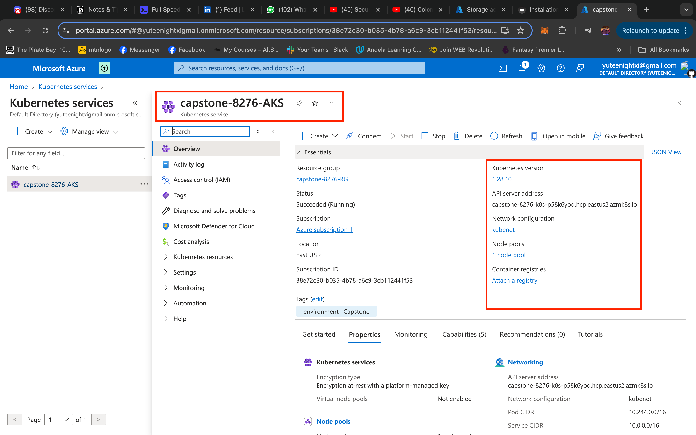

# Overview
A microservices-based application packaged using kubernetes is provided. There is need to automate it's deployment using a cloud service provider and DevOps core practices like automation, IaC, monitoring/logging and CI/CD. There is also need to ensure security measures and proper encryption for requests to the hosted application. 
The following tools/platforms will be used to implement the core requirements of the project:
- Terraform
- Azure Kubernetes Service
- Prometheus/Grafana
- Github Actions

## The Application
The provided application, SockShop uses a microservices architecture, it is deployed using docker and kubernetes. It has 14 microservices that both have at least a deployment and a service kubernetes object and they are all connected to each other. The application is accessible by the user via the `front-end` microservice.

## The Workflow
To deploy the application, several tools and best practices will be leveraged. Azure Kubernetes Service will be used as the cloud provider for infrastructure, Terraform for infrastructure as code (Azure Blob storage as a remote backend), Kubernetes for container orchestration (with Helm, it's package manager), Nginx Ingress Controller for routing traffic to the services within the cluster, Prometheus Stack for logging, monitoring and alerting, Github Actions to implement CI/CD, Let's Encrypt for certificate issuance and Azure Firewall for overall security.

Below is an overview of the complete workflow:
    

## The Process
### Prerequisites
Should you want to recreate the process using the code provided on this repo, you will need:
- Az CLI (configured to an active azure subscription)
- Helm installed
- Kubectl installed
- Terraform installed

__Project Folder setup:__
The project has two major folders, one for infrastructure management (terraform) and the other contians kubernetes files that manages the deployment of our sock-shop application.
    

### Steps
__Infrastructure__
Setting up infrastructure for this project is done using infrastructure as code. Terraform is an iac tool commonly used to provision infrastructure that will run cloud services, terraform goes beyond just cloud services as it also supports other providers like helm. The provided [terraform configuration](./terraform/main.tf) written in modules is used to create the following resources on Microsoft Azure:
- A resource group
- A virtual network and two subnets
- AKS (a managed kubernetes cluster)

Addditionally, the terrraform configuration is set up to use a remote backend for it's state management and the helm provider is used to install nginx ingress controller, prometheus and grafana on the cluster. In normal cases, the cluster will be created by IaC tool and after that team would use a helm package manager externally to manage the charts for the Kubernetes cluster, but with helm providers, terraform can be used directly to manage helm charts in a Kubernetes cluster, hence once the terraform configuration is applied, we wil have a fully managed kubernetes cluster ready to deploy our application.
    
    
    

__Deployment__
To get the the application up and running:
Locate the deployment file(s) that in the [kubernetes](./kubernetes/) directory and using `kubcetl` apply the deployment file(s) in the cluster using the following steps.

- __Apply manifest files__
    Do, `kubcetl apply -f kubernetes/deployment.yaml`, 
    After this, application should be up and running and you can inspect using kubectl commands like `get pods` and `get svc`. The app can also be accessed on the browser by port forwarding the `front-end` service nodeport.
        
        
        

- __Configure and apply [ingress](./kubernetes/ingress.yaml)__
     Ingress allows you to define rules for how external traffic should be directed to your services, enabling you to expose your applications to the internet or other networks. The ingress configuration is can be found in the oroject folder, configure and apply. Rememember to map your ingress IP address on your DNS service provider. If successful, the application should be up and available via the domain name.
        

__Securing HTTP Connection__
    The app is accessible via the domain name, but connection to it is not secure. Encrypting data from user requests to a web application is no longer a requirment, it is a necessity, users genraally feel safe when they visit webapps that are properly encrypted. 
    Cert-manager can be installed and using the issuer file provided, a tls certificate request can be made to letsencrypt.
        
        

__Logging, Monitoring & Alerting__
Prometheus is used in a cluster to get metrics on the state of the cluster and the apllication running on it. It can be configured and different set of metrics queried from it. Grafana is used alongside prometheus to monitor the state of your cluster and application, it gets metrics from prometheus and displays it in a visually appealling form.
The tools are already installed in the cluster. You have to configure the them and retreive the data you need to be displayed using grafana tho. Access the grafana webpage to build a dashboard using metrics from prometheus.

It is also ideal to define the prometheus and grafana endpoints using ingress so they can be accessible using the domain name. It is best practice to ensure this is only ecposed to specific persons within the organisation. Firewall rules and access retrictions can be sed here.

__Prometheus & Grafana__
While you would normally have to write configs to scrap metrics and setup alert rules or import dashboards on grafana. For this project, manisfest files have been provided, these files contain configmaps, doployments and services for prometheus and grafana. find deatailed steps to install them [here](https://github.com/microservices-demo/microservices-demo/tree/master/deploy/kubernetes/manifests-monitoring). So get the files and apply them in a monitoirng namespaces. This will create a namspace, cluster role bindings. The prometheus comes with rules that scrape metrics endpoints exposed by the application pods. It also has one alert rule configured. This alert rule, if fired, can be sent as a notification to a custom slack channel or email using alert manager which we will setup next. After installation, you can use either of the three methods to acccess the UI on your web browser. Portforwarding, Exposing and Ingress. I used an ingress and you can find the configuration [file](./kubernetes/sock-shop-monitoring/000-monitoring-ingress.yaml) here.
        
        
        
        
        
        
    _dashboard showing uptime of cluster and usage. also shows pods that went down within the period._

    __Alert Manager:__
    Alerting with Prometheus is separated into two parts. Alerting rules in Prometheus servers send alerts to an Alertmanager. The Alertmanager then manages those alerts, including silencing, inhibition, aggregation and sending out notifications via methods such as email, on-call notification systems, and chat platforms like slack. Here alertmanager manager was configured to set notifications to a dedicated slack channel.
        
        

__Github actions__
GitHub Actions is a powerful automation tool provided by GitHub. It allows you to define custom workflows that automate various tasks in your software development process. These tasks can include building, testing, and deploying your code, as well as performing other actions like sending notifications or creating releases.

For this project, I setup a workflow that runs on every push to the repo that holds the spplication code. The workflow is triggered when there is an update to any of the files in the terraform and kubernetes directory. The workflow has 4 jobs:
- __Test__ - performs a simple linting check on the yaml files, to ensure it's correctness. It breaks the pipeline and gives feedback if ther are any rrrors.
- __Infrastructure__ - handles the management of our aks cluster, hif ther ehas been any change to the terraform configuration, it runs terraform plan, and if there are any changes, proceeds to run terraform apply, if not it skips.
- __Deploy__ - applies all manifests files in other to effect changes to our configuration
- __Verify__ - here it verifies that the deployed update works fine and our app does not breaking by checking the availability of the app using the domain name.

    
    _a first test of the pipeline._

    

__Azure Firewall__
Azure firewall will be used to define certain rules to protect the infrastructure resources. The main approach here is to update my runnign cluster to create an azure firewall and a firewall policy that restrict incoming traffic to the grafana service running in the cluster only a specific IP address. Changes made will then be pushed to the repo and github actions workflow starts a pipeline to implement the update. This way, my grafana dashboard is accessible by authorixed person even tho it is served over the internet.

## The End?
DevOps never ends, as software is ever changing and evolving, having implemented ci/cd, continous integration of new code into existing one.
I will be making certain changes to my manifest files, and I will show how the workflow picks up the change and deploys it to kubernetes and rolls out an update to our hosted application.

__Continous Integration and Continous Deployment__
I will perform a little demo where I will update the domain name of the hosted application. The goal is to confirm that changes made to my configurations can be updated seamlessly by my workflow.
Before continuing, I wil first go to my dns server and add the new domain name, `sockshop.utibeokon.me` next I will:
- Edit ingress host with the a new configuration, it is currently `capstone.utibeokon.me`
    
- Push my code to the `main` branch
    
- Wait for pipeline to complete
    
- Visit application via new domain name
    

__Summary__
In this project, I successfully deployed a microservices-based application on an AKS cluster, leveraging Kubernetes for orchestration and core DevOps practices to ensure high availability. I also setup and proper monitoring system for the cluster and applications running in it. The deployment process, as well as further integrations, were fully automated using Infrasctructure as code, and futher updates have been made provision for using GitHub Actions to streamline the workflow and enable continuous integration and delivery. This approach not only enhanced the reliability and scalability of the application but also laid a solid foundation for future improvements and integrations.
